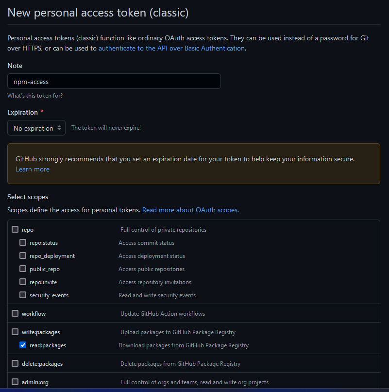
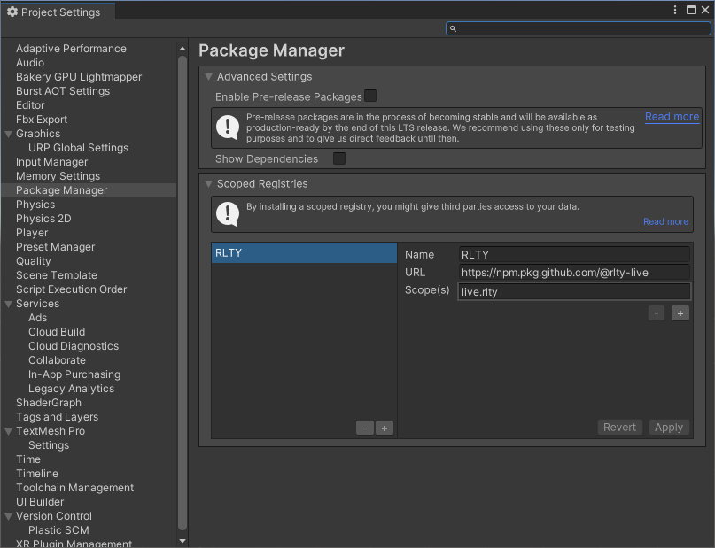
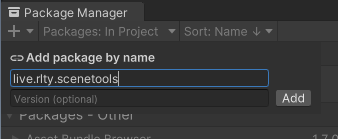
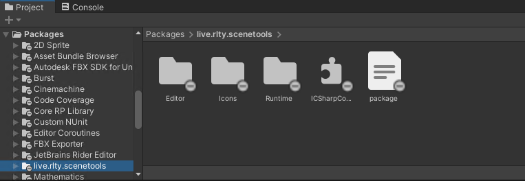

# RLTY Scenetools

This is a public package to build your own RLTY experiences.

## Installation

Use Unity 2021.3.4f1.

 - Make sure you have a GitHub account. GitHub requiers you to authenticate to download a public package.
 - Create a new personal access token: https://github.com/settings/tokens/new. Check only the scope `read:packages (Download packages from GitHub Package Registry)`
<details>
  <summary>Screenshot</summary>
  
  
</details>


## Configure access
  ## On Windows
 - Find or create the `.upmconfig.toml` file (see https://docs.unity3d.com/Manual/upm-config-scoped.html#upmconfigUser for details). On Windows, it is in `%USERPROFILE%\.upmconfig.toml`.
 - Add the token in the file like this:

  ```
  [npmAuth."https://npm.pkg.github.com/@rlty-live"]
  token = "<the new token>"
  ```

  ## On MacOS
  To create  .upconfig.toml  on mac:
  ".xxx" files cannot be created via Finder because these name formats are reserved for system files.

  To create them you have to use the Terminal:
  - Cmd + Space : Terminal

  In the terminal paste the following commands (without "")
  - 'cd /etc'                 (to access the global user folder)
  - 'touch .upconfig.toml'    (to create the file)
  - 'open .upmconfig.toml'    (to open it)
  You can also find it in finder by displaying the hidden files in finder options.
  
  ## On Both
  - Add the token in the file like this:
  ```
  [npmAuth."https://npm.pkg.github.com/@rlty-live"]
  token = "<the new token>"
  ```

 - Close all Unity Editor instance.
 - Configure the scope registry. You can do it from the Unity Editor (`Edit -> Project Settings`):

<details>
  <summary>Add RLTY Registries screenshot</summary>
  
  
</details>

 - In the package manager, add the package by name (`live.rlty.scenetools`) in your Unity project.

<details>
  <summary>Add SceneTools package screenshot</summary>
  
  
</details>

You can also directly edit manually the manifest (`Packages/package.json`), just add:
```json
{
  "dependencies": {
    "live.rlty.scenetools": "0.0.1",
    ...
  },
  "scopedRegistries": [
    {
      "name": "RLTY",
      "url": "https://npm.pkg.github.com/@rlty-live",
      "scopes": [
        "live.rlty"
      ]
    }
  ]
}
```

**Note 📝:** Check [github package version page](https://github.com/rlty-live/SceneTools/pkgs/npm/live.rlty.scenetools/versions) to use the last version. Development versions are marked with `-dev.XXX` and integration with `-int.XXX` where `XXX` is an number used internally. Chose a version without suffix to ensure stability.

 - You can know open your Unity project, and you should see the package.

<details>
  <summary>Screenshot</summary>
  
  
</details>

**Note 📝:** when browsing unity package manager, you will always get an error:
```
[Package Manager Window] Cannot perform upm operation: Unable to perform online search:
  Request [GET https://npm.pkg.github.com/@rlty-live/-/v1/search?text=live.rlty&from=0&size=250] failed with status code [405] [NotFound].
```
This is because GitHub doesn't have an API to get package list. You should ignore this error.
